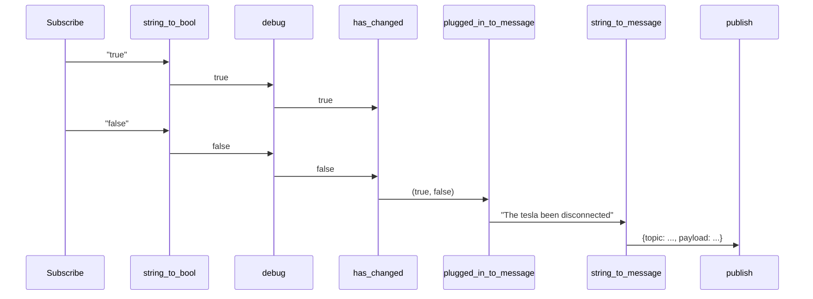

# robotica-node-rust

Manipulate asynchronous events, using asynchronous tasks.

## Getting started

Sample code in the `brian-node-rust` directory.

Sample helm chart im my helm report (see [instructions](https://github.com/brianmay/charts/) called `brian-node-rust`, note that is specific to my example, and requires the code implement a simple HTTP server for health checks. Various [values](https://github.com/brianmay/charts/blob/main/charts/brian-node-rust/values.yaml) need to be set. The image repository and tag can be overridden.

## Example Code

```rust
let car_id = 1;
let topic = format!("teslamate/cars/{car_id}/plugged_in");
subscriptions.subscribe(&topic)
    .filter_map(string_to_bool)
    .debug("plugged_in")
    .diff()
    .filter_map(plugged_in_to_string)
    .map(string_to_message)
    .publish(subscriptions, mqtt_out);
```

This will do the following:

* Subscribe to mqtt topic.
* Events get filtered via the `string_to_bool` function.

    ```rust
    pub fn string_to_bool(str: String) -> Option<bool> {
        match str.as_str() {
            "true" => Some(true),
            "false" => Some(false),
            str => {
                error!("Invalid bool {str} received");
                None
            }
        }
    }
    ```

* Events get filtered via debug plugin, which outputs them using `log::debug!(...)`.
* Checks to see if what the previous value (if any) was.
* `plugged_in_to_string` takes this value and turns it into a mqtt message.

    ```rust
    fn plugged_in_to_string((old, new): (Option<bool>, bool)) -> Option<String> {
        match (old, new) {
            (None, _) => None,
            (Some(false), true) => Some("The tesla has been plugged in".to_string()),
            (Some(true), false) => Some("The tesla been disconnected".to_string()),
            (Some(true), true) => None,
            (Some(false), false) => None,
        }
    }
    ```

* `string_to_message` takes the string message and converts it to an outgoing MQTT message. This is done using the message format expected by robotica.

    ```rust
    fn string_to_message(str: String) -> Message {
        let msg = AudioMessage {
            message: MessageText { text: str },
        };
        let topic = "command/Brian/Robotica";
        let payload = serde_json::to_string(&msg).unwrap();
        Message::new(&topic, payload, 0)
    }
    ```

* This value is sent using mqtt.

Here is a diagram to demonstrate an example flow. It is assumed that the threads just began. As a result `has_changed` does not consider the first message to have changed because it has nothing to compare it against.



## Rationale

My journey for IOT control has come via three solutions:

1. [Node Red](https://nodered.org/)
2. [Penguin Nodes](https://github.com/brianmay/penguin_nodes/) - Elixir solution
3. Robotica Node Rust - Rust solution

## Node Red

Node red looked really impressive at first. With lots of plugins.

But then I found it very restrictive and limiting. In particular a node can only take one input. This is considered a feature, and includes sub flows. Sure you can use blocks such as joiners, but in practise this adds a lot of complexity. And typically I just want to split it apart again in the sub flow.

I also wanted to be able to save state in each node, rather then only have global values for the entire flow.

As a result I wrote the perfect process for dealing with one light, and then I would have to copy and paste it for every other light in our house. And if I made changes I would have to duplicate the changes for every light. I hated this.

Also I found two independently written plugins I tried had life time issues. As in if click the button to redeploy node-red would shutdown all existing objects and create new objects. But some of the plugins would hold on to references to old objects for various callbacks. Which could lead to confusing behaviour. The maintainers were stumped. A detailed inspection of the code and everything would look OK. There are no tools available to diagnose such issues. I was only able to resolve them by asking "what if?" type questions and constantly prodding the maintainer. I also hated this.

I felt the "it works for me" altitude was common. People would write plugins to solve their problems, and not be terribly interested in solving bugs in their plugins. Which might also be because they felt they couldn't get support/help to solve problems that were beyond their capabilities.

The design of Node Red based on JavaScript doesn't feel like a solid foundation for a reliable and trustworthy system in my opinion.

I also feel nervous whenever I make changes directly to a live system with no provision for testing before deploying or saving a history of what has changed in git.

## Penguin Nodes

[Source](https://github.com/brianmay/penguin_nodes/)

Due to the problems with node red, I decided to do a rewrite in Elixir. My rewrite had some interesting features:

* Nodes represented by Elixir processes.
* System of ensuring each node has a unique id that survives restarts and re-ordering of nodes.
* Each node can have a state, timers, etc.
* If a process died it would be restarted on any node in the Elixir cluster.
* Nodes could receive messages from any number of sources nodes and send messages to one or more destinations.
* Deploys could be done with 0 down time by removing Kubernetes pods one at a time and the nodes would restart on existing pods.

I found a mqtt issue. If I unsubscribe from a mqtt topic and subscribe again, it server will not send the latest retain message. As a result it is not possible to know what the state of the topic is. I have worked around this problem for now by not allowing unsubscribe operations, so we are always getting the latest state.

I also encountered another problem. After a node was restarted on a new pod, it would lose its state. There is no guarantee it would get a message from its source nodes giving the node its correct state.

Initially I tried to get something like a distributed etcd running to save the state of the different processes. But had problems getting this to work, so ended up saving/restoring the state to a postgresql database instead.

This worked fine. But it was a complicated solution, and I don't have a lot of confidence in in. As an example, I noticed I forgot to implement the save state code for one of the nodes. Which should be easy right? But Saving state requires that the data be serializable. And the type less design of the system means that there cannot be any guarantees that the data is serializable. If I implemented this, would I be risking crashes because I used this for non-serializable data? Either now or in the future?

I tried to write code to to type checking on inputs and outputs, but this didn't work very well. And all the type checks were done at run-time not compile time. I initially tried to generate the graph of nodes and inputs/outputs at compile time, but this failed when this configuration contained call back functions.

I also added a web interface, using Elixir life views. This was to show logs from every node in real time. Unfortunately for reasons I didn't understand the load of messages - which wasn't really that many - was too much for Elixir to handle. Absolutely everything, every process slowed to a almost complete standstill. I had to turn off most of the logging in order to get acceptable performance. I thought maybe the logs were taking to much memory, but it was CPU that was up high, not memory usage.

Perhaps this was not a good usage case for the live views however. I was storing the last n log entries in the Elixir lie view processes in memory, which meant that logs would not get saved if there were too many of them, or if the web browser got disconnected or restarted.

I still like some features of this implementation. However I think it is far too complicated, and as a result I lack confidence in it, and my ability to make changes without accidentally breaking stuff.

As an example, just recently I have started experiencing a problem where it sometimes would not send the "The Tesla has been plugged in" message, and I have no idea why.

## Robotica Node Rust

Yes another rewrite. In Rust. Features:

* Design is considerably simpler.
* Uses asyncio tasks.
* Type checking between threads is enforced at compile time.
* Creating/maintaining/reading flows is a lot easier.
* Structured as a library, so the parts not-specific to my setup can be shared by different projects.
* On unexpected failure should hopefully exit to allow monitoring system (e.g. kubernetes) to restart.
* Updated to reduce excessive messages being sent that were the exact same as the last message.

Limitations:

* Lost the ability to automatically restart tasks. If one task fails, need to abort everything.
* As implemented, pipes can only have 1 receiver. Need to use split function if more required. Currently only implemented split2. A splitn function would be good.
* Can only have one copy at a time. Or you will get duplicate outgoing events.

Still to be implemented:

* Logging still needs more work. Not sure how to approach this yet.

* Haven't tried to save state. Hoping this won't be required. When the process starts it will subscribe to mqtt and pick up retained data which is sufficient for now. Have some ideas, but means the nodes will need to have a unique id and this is likely to add to the complexity.

* Not many building blocks supports. Still use node-red for some stuff, and this sends mqtt messages that we can intercept here.

* Tools to debug flows easily.
